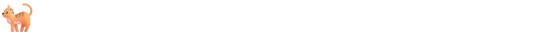

<!-- Visitor Badge -->
<div align="right">
  
</div>

<!-- Running Pet Animation -->
<div align="center">
  
</div>

<div align="center">
  <!-- Gradient Wavy Header -->
  
</div>

<br>

<!-- Animated Typing Header -->
<h1 align="center">
    
</h1>

<h3 align="center">Engineering the future with scalable architectures and embedded systems 🇱🇰</h3>

<br/>

### ⚡ About Me

I turn engineering insights into scalable architectures, embedded systems, and robust robotics solutions. Currently pursuing my BSc (Hons) in Electrical Engineering at the **University of Moratuwa**.

- 🔭 **Current Focus:** Micromouse Project (Team MazeRiders) & MazeMaster 2026.
- ⚙️ **Interests:** Robotics, Embedded Systems, PCB Design, and Software Architecture.
- 🏆 **Community:** Active member of the Electrical Engineering Society (EESoc).
- 🌐 **Portfolio:** [portfolio-virid-eight-31.vercel.app](https://portfolio-virid-eight-31.vercel.app/)
- 📫 **Contact:** madukageeganage@gmail.com

<br/>

<!-- Contact Badges -->
<div align="center"> 
  <a href="mailto:madukageeganage@gmail.com">
    
  </a>
  <a href="https://www.linkedin.com/in/maduka-malruk/" target="_blank">
    
  </a>
  <a href="https://portfolio-virid-eight-31.vercel.app/" target="_blank">
      
  </a>
</div>

<hr/>
 
<h2 align="center">⚒️ Languages, Frameworks & Tools ⚒️</h2>
<br/>
<div align="center">
    <!-- Skill Icons -->
    <a href="https://skillicons.dev">
      
    </a>
    <br><br>
    <a href="https://skillicons.dev">
      
    </a>
</div>

<br/>
<hr/>

<!-- Contribution Snake -->
<div align="center">
  <h2>🐍 My Contributions 🐍</h2>
  <br>
  <picture>
    <source media="(prefers-color-scheme: dark)" srcset="https://raw.githubusercontent.com/madukamalruk/madukamalruk/output/github-contribution-grid-snake-dark.svg">
    <source media="(prefers-color-scheme: light)" srcset="https://raw.githubusercontent.com/madukamalruk/madukamalruk/output/github-contribution-grid-snake.svg">
    
  </picture>
  <br/><br/>
</div>

<hr/>

<h2 align="center">⚡ GitHub Stats ⚡</h2>
<br>

<!-- Activity Graph -->
<div align="center">
  
</div>
<br>

<div align="center">
  <!-- GitHub Stats & Top Languages -->
  
  
</div>

<br>

<div align="center">
  <!-- Streak Stats -->
  
</div>

<br/><br/>
<hr/>

<!-- Developer Joke -->
<h2 align="center">😂 For Fun 😂</h2>
<br>
<div align="center">
  
</div>

<br/><br/>
<hr/>

<!-- Console Block at the bottom -->
<h2 align="center">💻 Console 💻</h2>
<br>

```cpp
class Maduka : public Engineer {
private:
    std::string handle   = "madukamalruk";
    std::string role     = "Electrical Engineering Undergrad @ UoM";
    std::string based_in = "Sri Lanka 🇱🇰";

public:
    std::vector<std::string> daily_driver() {
        return {"C/C++", "Python", "Arduino", "MATLAB"};
    }
    
    std::vector<std::string> leveling_up() {
        return {"ROS", "Advanced Control Systems", "PCB Design"};
    }
};
```

<br>

<!-- Footer Banner -->

